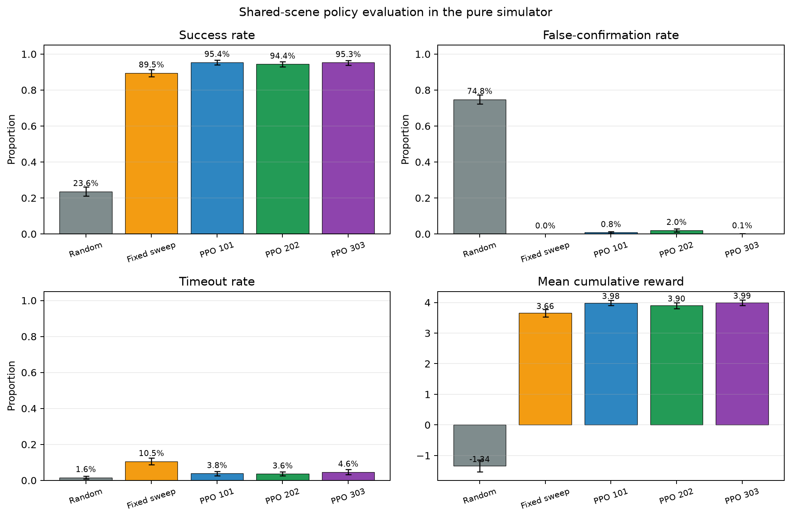

# Reinforcement Learning Using RGB-D Cues to Detect Material Impurity in a Battery Electrode Recycling Process

This repository contains the reproducible code and evidence for a **pure-simulation proof of concept**. It does not contain measurements from a physical RGB-D camera or real battery-electrode samples.

The simulator produces a synthetic RGB image and a synthetic relative-height channel. The latter is expressed in dimensionless **synthetic relative-height units (SRHU)** and must not be interpreted as millimetres or measured coating thickness. A PPO agent moves an inspection window and decides when to confirm a residue-containing region.

## Repository contents

| Path | Purpose |
|---|---|
| `rl_environment.py` | Procedural scene generator and Gymnasium environment. |
| `train_ppo_three_seeds.py` | Trains PPO (Proximal Policy Optimisation) with seeds 101, 202 and 303. |
| `evaluate_three_seed_models.py` | Evaluates random, fixed-sweep and PPO policies on shared test scenes. |
| `experiments_reproducible_v3/` | Included trained models, training summary and training curve. |
| `evaluation_outputs_reproducible_v3/` | Episode-level data, summary tables and report figures. |
| `REPRODUCTION_GUIDE.md` | Detailed step-by-step reproduction guide. |

## Software environment

The reported run used Python 3.11.9. Exact package versions are listed in `requirements.txt`.

On Windows PowerShell:

```powershell
py -3.11 -m venv .venv
.\.venv\Scripts\Activate.ps1
python -m pip install --upgrade pip
python -m pip install -r requirements.txt
```

## Reproduction

### 1. Verify the environment logic

```powershell
python .\rl_environment.py
```

Expected checks include an observation shape of `(7,)` and confirmation that the same explicit seed reproduces the same observation.

### 2. Re-evaluate the included trained models

Use a new output directory because the evaluator deliberately refuses to overwrite existing evidence:

```powershell
python .\evaluate_three_seed_models.py `
  --experiment-dir .\experiments_reproducible_v3 `
  --output-dir .\reproduced_evaluation `
  --training-seeds 101 202 303 `
  --episodes 1000 `
  --calibration-episodes 100 `
  --modality-scenes 200 `
  --evaluation-seed 20260827
```

The **evaluation seed** is only a fixed random-number starting point. It makes the same calibration, test and bootstrap-resampling sequences reproducible; it has no physical meaning.

### 3. Retrain all three models from scratch (optional full reproduction)

```powershell
python .\train_ppo_three_seeds.py `
  --seeds 101 202 303 `
  --timesteps 35000 `
  --output-dir .\retrained_models
```

Then evaluate the new models by replacing `--experiment-dir` with `.\retrained_models`. Training is deterministic on the reported CPU setup, but exact binary files or training time may differ across operating systems and numerical-library builds.

## Reported policy results

Each policy was evaluated on the same 1,000 synthetic scenes. Intervals are non-parametric **bootstrap 95% confidence intervals** based on 3,000 resamples.

| Policy | Success | False confirmation | Timeout | Mean reward | Mean steps |
|---|---:|---:|---:|---:|---:|
| Random | 23.6% | 74.8% | 1.6% | -1.344 | 3.95 |
| Fixed sweep | 89.5% | 0.0% | 10.5% | 3.657 | 6.10 |
| PPO seed 101 | 95.4% | 0.8% | 3.8% | 3.984 | 5.57 |
| PPO seed 202 | 94.4% | 2.0% | 3.6% | 3.902 | 5.62 |
| PPO seed 303 | 95.3% | 0.1% | 4.6% | 3.994 | 5.59 |

Across the three PPO training seeds, mean success was 95.03%, with a sample standard deviation of 0.55 percentage points. The complete unrounded results are in `evaluation_outputs_reproducible_v3/policy_summary.csv` and `ppo_across_training_seeds.csv`.



## Key terms

- **RGB-D (colour plus depth)** normally means aligned colour and physical depth images. In this repository, the second channel is simulated relative height, not camera depth.
- **Observation** is the seven-number input available to the policy at one step; it is not the complete hidden simulator state.
- **Ground-truth mask** is the hidden procedural residue region used only for reward and evaluation.
- **Seed** fixes a pseudo-random sequence so an experiment can be repeated.
- **Fixed sweep** moves through the scene using a hand-written rule and confirms when the observed cue exceeds a calibrated threshold.
- **Timeout** means the episode reached its movement or step limit without a correct confirmation.

## Scope and limitations

- Every result is generated in simulation; no real electrode, camera, conveyor or robot was tested.
- The relative-height signal and the ground-truth mask originate from the same latent ellipse geometry. This makes the height benchmark favourable and does not establish real-sensor validity.
- Every current scene contains residue, so sample-level false alarms on completely clean foil were not tested.
- The simulator does not model invalid depth pixels, aluminium reflections, perspective, lens distortion or conveyor vibration.
- No pixel-to-millimetre calibration is used, so no physical residue size or coating thickness is claimed.
