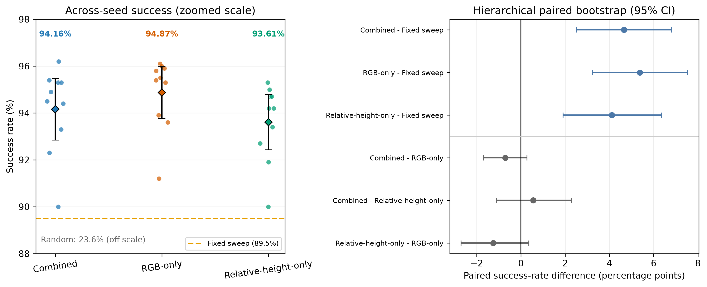
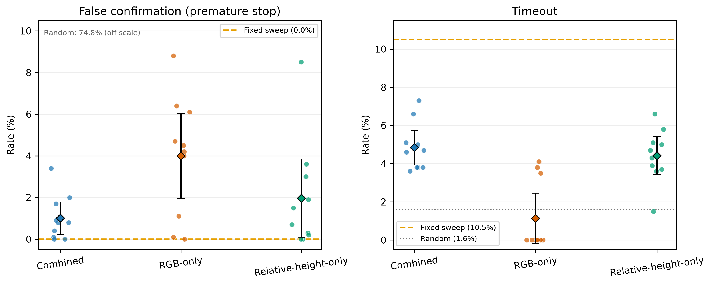
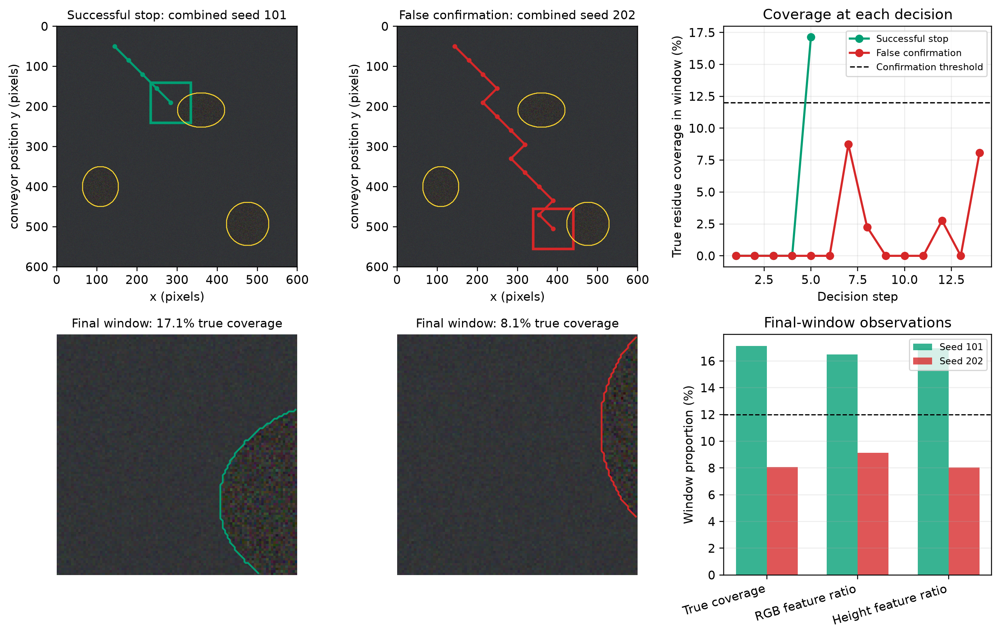

# Reinforcement Learning Using RGB-D Cues to Detect Material Impurity in a Battery Electrode Recycling Process

This repository contains a reproducible procedural-simulation study of active residue inspection. The simulator generates co-indexed RGB and dimensionless relative-height arrays, and a PPO policy moves an inspection window before deciding when to confirm a region.

The final experiment trains three controlled input conditions with 10 seeds each:

- `combined`: RGB-texture and relative-height features are available;
- `rgb_only`: the two height-derived observation values are zeroed;
- `height_only`: the two RGB-derived observation values are zeroed.

All conditions retain the same seven-value observation shape, network, reward, action space, procedural scene distribution and 35,000-requested-timestep budget.

## Repository contents

| Path | Purpose |
|---|---|
| `step3_rl_environment_reproducible.py` | Procedural scene generator, observation ablation and Gymnasium environment. |
| `train_multimodal_10seeds.py` | Trains combined, RGB-only and relative-height-only PPO policies with 10 seeds and records timing. |
| `evaluate_multimodal_10seeds.py` | Runs shared-scene evaluation, seed summaries, hierarchical paired bootstrap and failure-case output. |
| `redraw_policy_figures.py` | Rebuilds the clearer report plots from archived summary CSV files without rerunning policies or changing statistics. |
| `experiments_multimodal_10seeds/` | Thirty trained models, reward histories, hashes, timing summaries and the training figure. |
| `evaluation_outputs_multimodal_10seeds/` | Episode-level data, statistical tables, timing data and final report figures. |
| `REPRODUCTION_GUIDE.md` | Step-by-step full and quick reproduction instructions. |
| `train_ppo_three_seeds.py`, `evaluate_three_seed_models.py` | Preserved legacy three-seed workflow for the earlier analysis. |

## Software environment

The reported run used Python 3.11.9 and the pinned packages in `requirements.txt`.

```powershell
py -3.11 -m venv .venv
.\.venv\Scripts\Activate.ps1
python -m pip install --upgrade pip
python -m pip install -r requirements.txt
```

## Reproduce the final evaluation

The evaluator deliberately refuses to overwrite a non-empty output directory.

```powershell
python .\evaluate_multimodal_10seeds.py `
  --experiment-dir .\experiments_multimodal_10seeds `
  --output-dir .\reproduced_evaluation_multimodal `
  --training-seeds 101 202 303 404 505 606 707 808 909 1010 `
  --modes combined rgb_only height_only `
  --episodes 1000 `
  --calibration-episodes 100 `
  --modality-scenes 200 `
  --evaluation-seed 20260827 `
  --workers 3
```

## Retrain all 30 policies

```powershell
python .\train_multimodal_10seeds.py `
  --seeds 101 202 303 404 505 606 707 808 909 1010 `
  --modes combined rgb_only height_only `
  --timesteps 35000 `
  --workers 3 `
  --output-dir .\retrained_multimodal_10seeds
```

If a run is interrupted, repeat the command with `--resume`. Complete condition/seed folders are retained and only missing runs are trained.

## Final policy results

Every policy received the same 1,000 scene and starting-position seeds. PPO rows are means across 10 training seeds; the standard deviation is across those seeds.

| Condition | Mean success | Sample SD | Seed range | Mean false confirmation | Mean timeout |
|---|---:|---:|---:|---:|---:|
| Combined PPO | 94.16% | 1.84 pp | 90.0--96.2% | 1.01% | 4.83% |
| RGB-only PPO | 94.87% | 1.55 pp | 91.2--96.1% | 3.99% | 1.14% |
| Relative-height-only PPO | 93.61% | 1.66 pp | 90.0--95.3% | 1.97% | 4.42% |
| Fixed sweep | 89.5% | -- | -- | 0.0% | 10.5% |
| Random | 23.6% | -- | -- | 74.8% | 1.6% |

The hierarchical paired bootstrap resampled both the 10 training seeds and 1,000 shared scenes. Combined minus fixed sweep was +4.66 percentage points (95% CI 2.51 to 6.82). The corresponding intervals for RGB-only and relative-height-only versus fixed sweep were also above zero. All pairwise intervals among the three PPO input conditions crossed zero, so the experiment does not identify one PPO input condition as more accurate than the other two.



The similar PPO success rates are consistent with cue redundancy in the generator. RGB variance and positive relative height are placed using the same latent ellipse geometry. In the mask benchmark, relative-height thresholding already achieved F1 0.995, RGB texture achieved F1 0.978 and late-OR fusion achieved F1 0.980. Fusion therefore did not improve on the near-perfect height result in this generator family.



Every formal scene contains residue. The reported false-confirmation rate therefore means premature stopping below the 12% local-coverage criterion; it is not a false alarm on clean foil.

## Redraw the report figures without rerunning evaluation

```powershell
python .\redraw_policy_figures.py `
  --input-dir .\evaluation_outputs_multimodal_10seeds
```

This command reads the archived policy, condition and paired-bootstrap summaries. It changes only the visual presentation and leaves all formal statistics unchanged.

## Failure-case output

Scene seed `2215982` gives an illustrative policy-level contrast. Combined seed 101 stopped successfully at step 5 with 17.13% true coverage; combined seed 202 falsely confirmed at step 14 with 8.07% true coverage, below the 12% success criterion.



## Computational cost

- Thirty training tasks summed to 107.46 minutes; three concurrent workers completed them in 36.1 minutes elapsed time.
- A run averaged 214.92 +/- 3.43 seconds for 35,072 stored timesteps.
- Thirty PPO evaluation tasks summed to 15.39 minutes and averaged 30.78 +/- 0.31 seconds per 1,000-scene policy.
- The complete evaluation workflow took 6.79 minutes elapsed time with three workers.

These are measured wall-clock values for the reported CPU execution. Complete timings are stored in `training_cost_summary.csv` and `evaluation_timing.csv`.

## Main output files

- `policy_condition_summary.csv`: condition-level means, sample SDs, ranges and t-based intervals across 10 seeds;
- `paired_bootstrap_summary.csv`: paired success-rate differences and 95% intervals;
- `policy_summary.csv`: scene-bootstrap summaries for each individual policy;
- `episode_results.csv`: 32,000 policy-by-scene records;
- `failure_case_seed_2215982.csv`: exact actions and final-window values for the illustrated case;
- `evaluation_metadata.json`: seeds, hashes, settings and statistical definitions.

## Interpretation boundary

The evidence supports a PPO improvement over fixed sweep under the implemented procedural distribution. Relative height is expressed in synthetic relative-height units (SRHU), and the mask benchmark shares latent geometry with the generator. A future clean-aware task should add explicit clean scenes to training and evaluation, separate terminal decisions for accepting clean foil and identifying residue, and report false acceptance on contaminated scenes and false rejection on clean scenes. Transfer to intact electrodes and other surface distributions also requires separate validation.
